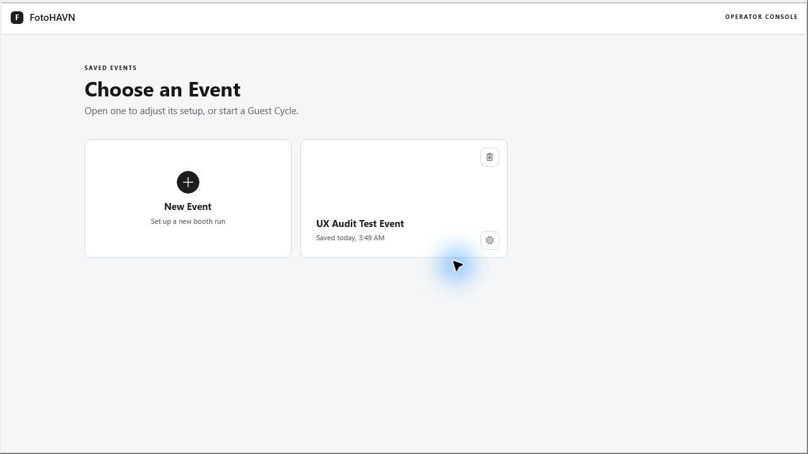
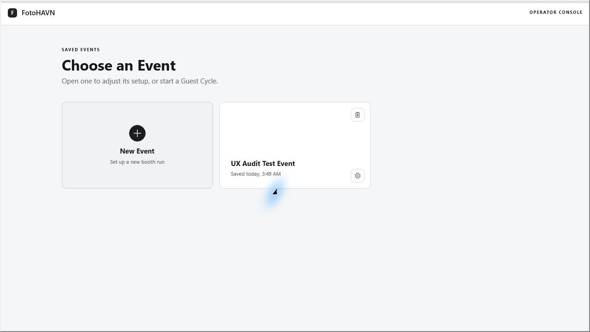
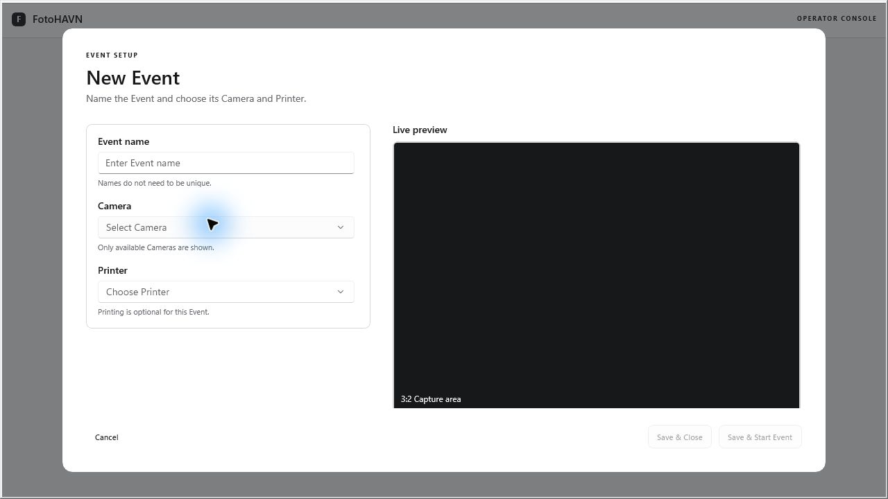
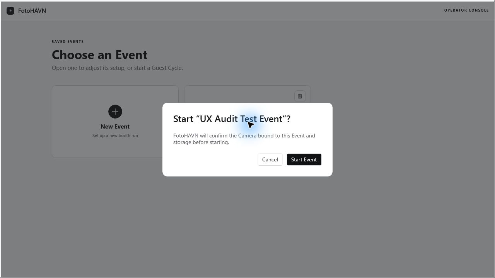
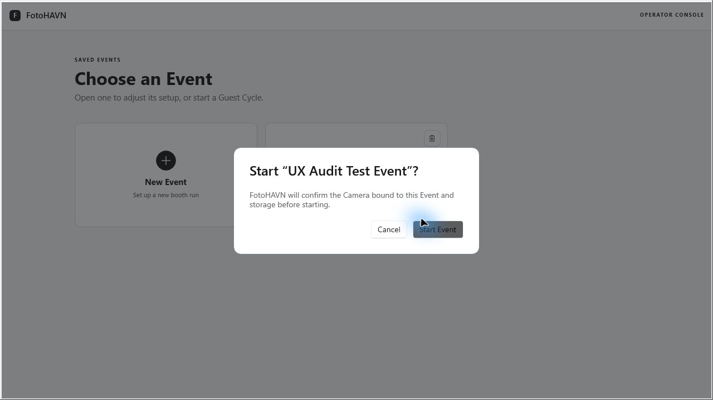
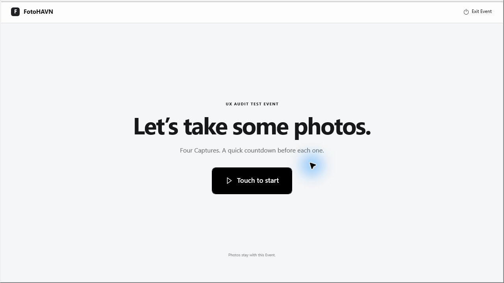
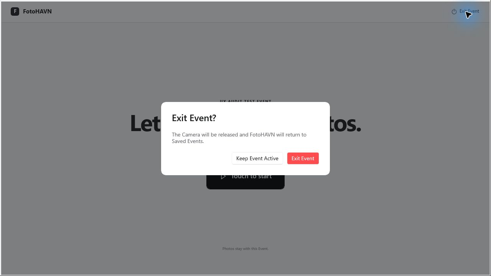
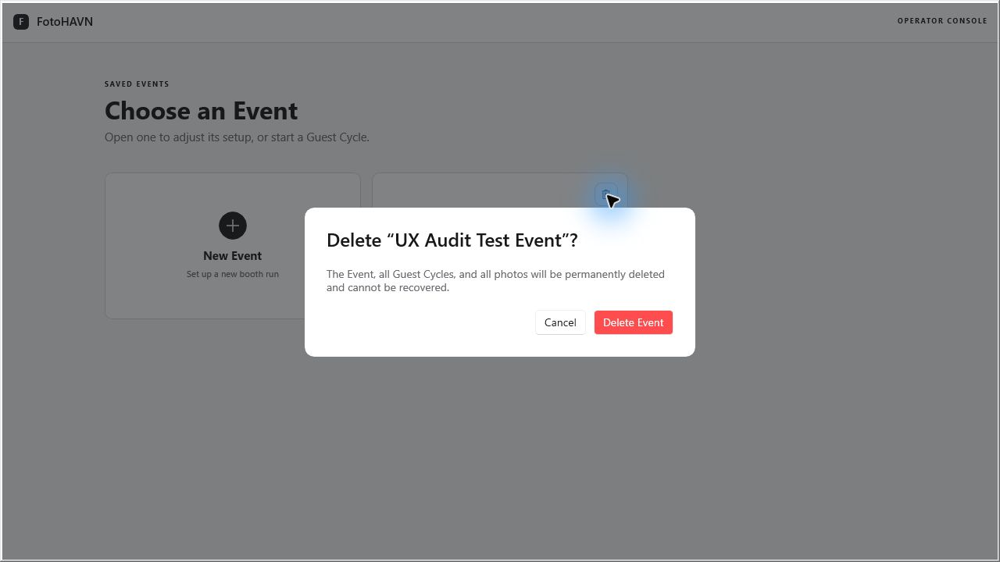

# FotoHAVN UI/UX Audit

Date: 2026-08-06  
Surface: Running FotoHAVN Windows app  
Viewport observed: 1280 × 720  
Audit type: Combined UX and accessibility-risk review

## Overall verdict

FotoHAVN has a strong visual foundation: the hierarchy is calm and legible, the event setup form is easy to scan, the guest start screen has a clear primary action, and permanent deletion is protected by explicit confirmation copy.

The biggest usability problems are in interaction state and discoverability. The primary **Start Event** action is invisible until hover or focus, several asynchronous transitions leave the old screen visible with no progress message, and the supposedly optional printer behaves like a required field. The most important accessibility risks are modal focus management, undersized operator controls, and insufficient white-text contrast on the current danger color.

No release-blocking crash was observed. The highest-priority findings are material enough to cause repeated clicks, uncertainty, touch errors, or selection of the wrong event.

## Audit scope

The following running-app flows were exercised:

1. View the empty/saved-events screen.
2. Open New Event.
3. Inspect event name, camera, printer, preview, disabled, and enabled states.
4. Create a clearly labeled test event.
5. Open Edit Event and inspect keyboard focus behavior.
6. Start a saved event through its confirmation dialog.
7. Inspect the guest-facing start screen.
8. Exit the active event through its confirmation dialog.
9. Open and cancel permanent event deletion.

The audit event `UX Audit Test Event` remains in the app. It was not deleted because permanent local deletion was outside the safe, non-destructive audit path.

## User goals

- An operator should be able to create and configure an event with confidence.
- An operator should be able to find, distinguish, start, edit, and delete the intended event safely.
- A guest should immediately understand how to begin a photo session.
- Every delayed operation should clearly communicate that FotoHAVN is working and prevent duplicate input.
- Keyboard, touch, and assistive-technology users should be able to understand and operate every core control.

## What is already working well

- The type scale and whitespace create a calm, professional visual hierarchy.
- New Event is highly discoverable and has a generous hit area.
- The event setup fields are grouped logically, with a useful live preview and concise helper text.
- The guest start screen has one dominant call to action and minimal distraction.
- Start, exit, and permanent-delete decisions have confirmation dialogs.
- The delete dialog clearly states that events, guest cycles, and photos cannot be recovered.
- Icon-only Delete and Edit controls have accessible automation names.
- The live preview exposes an accessible name and description.
- The existing deletion flow already includes a progress ring; it is a good pattern to reuse for other delayed actions.

## Flow evidence

### Step 1 — Saved Events — Needs work

The screen is clean, but the saved event card exposes only its name, save time, Delete, and Edit. Its primary **Start Event** action is not visible in the resting state. A touch user has no hover preview, and an operator cannot see camera, printer, storage, or readiness status before starting.

### Step 2 — Open New Event — Poor transition feedback

Immediately after New Event is activated, the previous screen remains visible. There is no progress ring, changing label, skeleton, or status text to explain that the setup dialog is being prepared. This is the same interaction pattern the user reported during event creation.

### Step 3 — Configure a New Event — Needs work

The stable form is visually clear. The main problem is validation communication: both save actions are disabled, but the UI does not say which requirement is missing. Although the printer is labeled optional, saving did not become available until **No Printer** was explicitly selected.

### Step 4 — Confirm Start Event — Mostly healthy

The confirmation is well structured, but “confirm the Camera bound to this Event and storage” is implementation language. It does not tell the operator how long the check might take or how the working state will appear.

### Step 5 — Start Event in progress — Needs work

About 126 ms after confirming in this capture, the button was disabled and dimmed while the dialog remained visible. There was no spinner, “checking” label, or accessible busy announcement. The operation completed on the next observation, but a slower device or camera makes this state much more noticeable.

### Step 6 — Guest start screen — Healthy with copy and control risks

The guest’s next action is obvious and appropriately large. The copy can be more natural, and the operator-only Exit Event control remains visually available to guests. The confirmation protects it, but an operator affordance or guarded gesture would reduce accidental interruptions.

### Step 7 — Exit Event — Mostly healthy

The dialog clearly explains the camera and destination. The danger action uses the current bright-red token, which does not provide sufficient contrast for small white text and differs from the darker red already used by the discard component.

### Step 8 — Delete Event — Mostly healthy

The permanence warning is strong. The dialog identifies the event by name only, which is risky because the setup flow explicitly allows duplicate names. The bright danger button also has the same contrast issue as Exit Event.

## Prioritized findings and proposed changes

Priority definitions:

- **P1 — High:** likely to cause task failure, repeated input, wrong-event action, or an accessibility barrier.
- **P2 — Medium:** creates recurring friction, inconsistency, or reduced confidence.
- **P3 — Low:** polish that should follow the structural fixes.

### P1-01 — Start Event is hidden until hover or focus

**Evidence:** Step 1. The resting event card does not show a Start action. The implementation sets the Start button opacity to `0` until hover or focus.

**User impact:** Mouse users must discover an undocumented hover state. Touch users have no hover state and may tap an invisible action. Keyboard users have to find a control that is not initially visible.

**Recommendation:** Keep a visible **Start Event** button on every ready event card. If the full card is clickable, add a persistent play icon and “Start Event” label, use a visible hover/focus treatment, and keep the event name readable rather than fading it to 16% opacity.

### P1-02 — Delayed actions have no meaningful busy state

**Evidence:** Steps 2 and 5. New Event leaves the list unchanged for a frame. Starting an event disables the confirmation button while the dialog remains unchanged. Similar delayed closure was observed after save and exit.

**User impact:** Operators cannot tell whether the click registered, so they may click again, wait uncertainly, or assume FotoHAVN is frozen.

**Recommendation:** Define and reuse a four-state action pattern:

1. **Idle:** normal label and enabled action.
2. **Busy:** immediately disable all conflicting actions, keep the primary button width stable, show a progress ring, and change the label to the current task.
3. **Success:** move to the destination and optionally show a short confirmation toast.
4. **Error:** keep context, explain what failed, and provide Retry.

Suggested labels:

- `Opening event setup…`
- `Saving event…`
- `Checking camera and storage…`
- `Starting event…`
- `Releasing camera…`

If spinner flicker is a concern, change the text immediately and delay only the spinner by roughly 150 ms. Announce the busy label through a polite live region or equivalent WinUI accessibility mechanism.

### P1-03 — Optional printer behaves like a required field

**Evidence:** Step 3. Save remained disabled after entering a name and selecting the available camera. It became enabled only after opening Printer and selecting **No Printer**.

**User impact:** The helper text says printing is optional, but the interaction says a printer decision is mandatory. Operators may believe the form is broken because there is no validation message.

**Recommendation:** Preselect **No Printer** for a new event, and label the field `Printer (optional)`. If an explicit choice is operationally important, keep the placeholder but show an inline message beside the disabled actions: `Choose a printer or select No Printer to continue.`

### P1-04 — Disabled save actions do not explain what is missing

**Evidence:** Step 3. Both save actions are visibly disabled with no validation summary or field-level error.

**User impact:** The operator must guess whether name, camera, printer, preview, or storage is blocking progress.

**Recommendation:** Add a compact readiness checklist or field-level status above the actions. For example:

- Event name — ready
- Camera — select a camera
- Printer — No Printer
- Storage — ready

Avoid using a disabled button as the only validation message.

### P1-05 — Modal focus and keyboard traversal need correction

**Evidence:** After Start, Exit, and Delete dialogs opened, the accessibility focus remained on the underlying pane. Repeated automated Tab presses in Edit Event did not move focus away from the Event name field, and Tab from the Delete dialog did not move focus to its actions.

**User impact:** Keyboard and screen-reader users may not know that a dialog opened, may reach background controls, or may be unable to move to the intended action.

**Recommendation:** When a dialog opens, programmatically focus its heading or safest action; trap focus within the dialog; expose the rest of the window as unavailable to accessibility APIs; support Escape where safe; and restore focus to the invoking control when the dialog closes. Verify manually with Tab, Shift+Tab, Enter, Space, Escape, Narrator, and at least one external keyboard.

**Evidence note:** The Tab behavior was observed through Windows UI automation and should be confirmed with a physical keyboard before being treated as a proven blocker.

### P1-06 — Danger color fails small-text contrast and is inconsistent

**Evidence:** Steps 7 and 8. `DangerBrush` is `#FF4D4F`; white on this color measures approximately **3.27:1**, below the 4.5:1 target for the small button text. The existing `ModalDangerButtonStyle` uses the darker `#D4382E`, which measures approximately **4.77:1** with white.

**User impact:** Destructive actions are harder to read, especially for low-vision users. Different destructive components look unrelated even though they have the same semantic meaning.

**Recommendation:** Make one semantic danger component and token set. Reuse the already safer `#D4382E` background for destructive primary buttons, define hover/pressed/focus states, and use a subtle danger surface such as the existing pale red for icon-only warnings. Do not mix `DangerBrush` and a separate hard-coded modal red.

### P1-07 — Duplicate event names can lead to wrong-event actions

**Evidence:** The form explicitly says names do not need to be unique. Event cards and Delete confirmation identify an event by name and save time only; the confirmation uses the name alone.

**User impact:** Two weddings, school events, or test runs with the same name are difficult to distinguish. An operator could start, edit, or permanently delete the wrong event.

**Recommendation:** Either warn on duplicate names or add a stable disambiguator everywhere consequential: creation date/time, short event ID, location, or folder name. The delete dialog should repeat at least two identifiers and may include counts such as `4 guest cycles · 16 photos` when available.

### P1-08 — Event action targets are too small for the touch-oriented product

**Evidence:** Step 1. Delete and Edit appear as small corner icons. The shared `EventActionButtonStyle` defines 30 × 30 controls, while the guest experience explicitly uses “Touch to start.”

**User impact:** Operators can miss the target on a touchscreen, especially under event conditions. Delete sits close to the card edge, increasing accidental taps.

**Recommendation:** Use at least 44 × 44 effective hit areas, preferably 48 × 48 for event-floor touch hardware. Keep the icon 16–20 px, provide visible hover/focus/pressed states, and separate destructive actions from routine actions.

### P2-01 — The gear icon communicates settings, not edit

**Evidence:** Step 1. Edit Event is rendered as a gear.

**User impact:** Operators may expect device or application settings rather than editing this event.

**Recommendation:** Use a pencil/edit icon and a tooltip or visible label. Reserve the gear for global or device settings.

### P2-02 — Event cards do not show readiness

**Evidence:** Step 1. The card shows only name and save time, while Start Event performs camera and storage checks.

**User impact:** The operator cannot anticipate why startup may take time or fail.

**Recommendation:** Add a compact readiness row such as `Camera ready · No printer · Storage ready`. Use neutral statuses rather than green everywhere; reserve warning colors for items requiring action.

### P2-03 — Button hierarchy varies between dialogs

**Evidence:** The setup dialog uses a low-emphasis text-style Cancel, Start uses default/black actions, Exit and Delete use the bright danger token, and Discard uses a separate darker danger style.

**User impact:** Operators must relearn button emphasis in each modal, and destructive severity is not expressed consistently.

**Recommendation:** Standardize four button variants across the app:

- Primary — black background, white text.
- Secondary — white background, neutral border.
- Tertiary — text/transparent for low-emphasis cancel.
- Danger primary — accessible dark red background, white text.

Keep height, radius, font size, focus ring, disabled treatment, and spacing consistent.

### P2-04 — System language leaks into user-facing copy

**Evidence:** Step 4 uses “Camera bound to this Event and storage.” The guest screen says “Four Captures. A quick countdown before each one.”

**User impact:** “Bound” and “captures” are technical terms. Capitalizing domain nouns in sentences makes the copy feel system-generated.

**Recommendation:** Prefer plain task language:

- `FotoHAVN will check the selected camera and storage before opening the booth.`
- `We’ll take four photos, with a short countdown before each one.`
- If accurate: `Photos are saved locally to this event and are not uploaded.`

### P2-05 — Operator exit is exposed in the guest experience

**Evidence:** Step 6. Exit Event remains in the top-right header of the guest start screen.

**User impact:** Guests can interrupt the booth flow and reach an operator decision dialog.

**Recommendation:** Consider an operator affordance that remains recoverable but is less guest-facing: a long press, a press-and-hold label, a corner gesture, or an operator PIN if the deployment needs stronger separation. Keep the current confirmation as a second safeguard.

### P2-06 — Fixed setup dialog size risks clipping on smaller windows

**Evidence:** At 1280 × 720, the 1100 × 640 setup dialog nearly fills the usable area. The implementation fixes both dimensions.

**User impact:** Smaller screens, Windows scaling, or a resized window can crop the dialog or hide actions.

**Recommendation:** Use max dimensions with responsive columns. Collapse to a single-column, scrollable form below the width threshold, keep actions sticky, and test 1024 × 768, 1280 × 720 at 125%/150% scaling, and 200% zoom-equivalent conditions.

### P2-07 — Visual headings are not exposed as headings

**Evidence:** The accessibility tree reports section titles such as “Choose an Event,” “New Event,” and modal titles as plain text rather than semantic headings.

**User impact:** Screen-reader users cannot navigate quickly by heading or reliably understand dialog structure.

**Recommendation:** Set appropriate WinUI heading levels for page, section, and dialog titles. Give each dialog a programmatic name/description linked to its visible title and supporting text.

### P3-01 — Capitalization and terminology are inconsistent

Examples include `Event`, `Camera`, `Printer`, `Guest Cycle`, `Captures`, and `Saved Events` appearing as title-case domain terms inside sentences.

**Recommendation:** Use sentence case in prose and reserve title case for labels and headings. Choose either “photo” or “capture” based on audience; guests should generally see “photo.”

### P3-02 — Success feedback is implicit

After saving, the setup dialog closes and the new event card appears. This proves success, but the operator must infer it.

**Recommendation:** Add a short non-blocking confirmation such as `Event saved` or `Event updated`, while keeping the new/updated card visible and focused.

## Proposed component standard

| Component | Standard |
|---|---|
| Primary action | 44 px minimum height; black background; white text; visible focus; busy label and spinner |
| Secondary action | 44 px minimum height; white surface; neutral border; dark text |
| Tertiary action | 44 px effective target; transparent surface; visible hover/focus |
| Danger action | One semantic dark-red token with at least 4.5:1 white-text contrast |
| Icon action | 44 × 44 minimum hit area; 16–20 px icon; tooltip; accessible name |
| Modal | Focus on open; trapped focus; Escape where safe; focus restored on close; background hidden from accessibility tree |
| Async transition | Immediate label change; conflicting actions disabled; spinner/status; polite announcement; success/error resolution |
| Required input | Explicit required/optional label; visible field error or readiness reason; disabled CTA is never the only explanation |

## Recommended implementation order

### Pass 1 — Prevent confusion and errors

1. Keep Start Event visible on saved-event cards.
2. Add busy states to Open, Save, Start, and Exit by reusing the deletion progress pattern.
3. Default Printer to No Printer or explain the required choice.
4. Show why Save is disabled.
5. Increase Edit/Delete touch targets.

### Pass 2 — Standardize safety and accessibility

1. Unify danger tokens and button variants.
2. Correct modal focus, keyboard traversal, and accessibility isolation.
3. Add event disambiguators to cards and destructive confirmations.
4. Replace the gear with an edit icon.
5. Add semantic heading levels and busy announcements.

### Pass 3 — Refine confidence and resilience

1. Add event readiness summaries.
2. Rewrite system-oriented copy.
3. Make setup responsive to window size and scaling.
4. Add concise save/update success feedback.
5. Reconsider how operator exit is exposed in guest mode.

## Evidence limits and follow-up tests

- The full four-photo guest cycle was not started because it would capture and store real photos from the live camera. Countdown, capture, retry, strip generation, and return-timer states still need a privacy-safe test setup.
- Permanent deletion was opened and canceled; the deletion progress, success, incomplete, and retry states were not executed.
- Storage-unavailable, camera-disconnected, no-camera, and printer-error states were not induced.
- The audit used the running app at 1280 × 720. Smaller windows, Windows display scaling, high contrast, reduced motion, and zoom/reflow were not exercised.
- The accessibility review is risk-focused, not a WCAG compliance claim. Narrator, keyboard-only navigation, switch access, and contrast across every state require dedicated verification.
- The 126 ms figure in Step 5 is an immediate post-click sample, not an end-to-end performance benchmark. The finding is the absence of feedback during the observed intermediate state, not the exact duration.

## Source-checked implementation notes

These code observations support the running-app findings and can speed up the fix:

- `StartEventButton` begins at `Opacity="0"` in `MainWindow.xaml`.
- `EventActionButtonStyle` fixes icon actions at 30 × 30 in `App.xaml`.
- `DangerBrush` is `#FF4D4F`, while `ModalDangerButtonStyle` uses `#D4382E`.
- Only event deletion currently exposes a `ProgressRing`; Open, Save, Start, and Exit do not show an equivalent busy treatment.
- `SetupDialog` is fixed at 1100 × 640.
- Save buttons are enabled only from presentation state, with no adjacent explanation of the unmet requirement.

