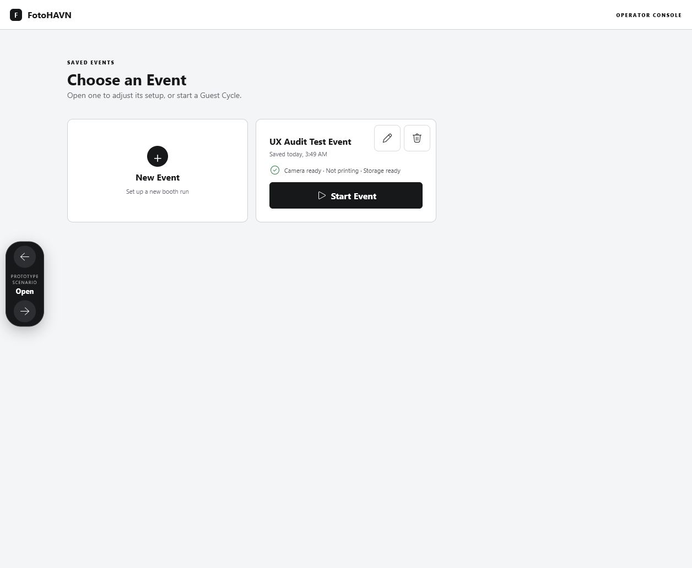
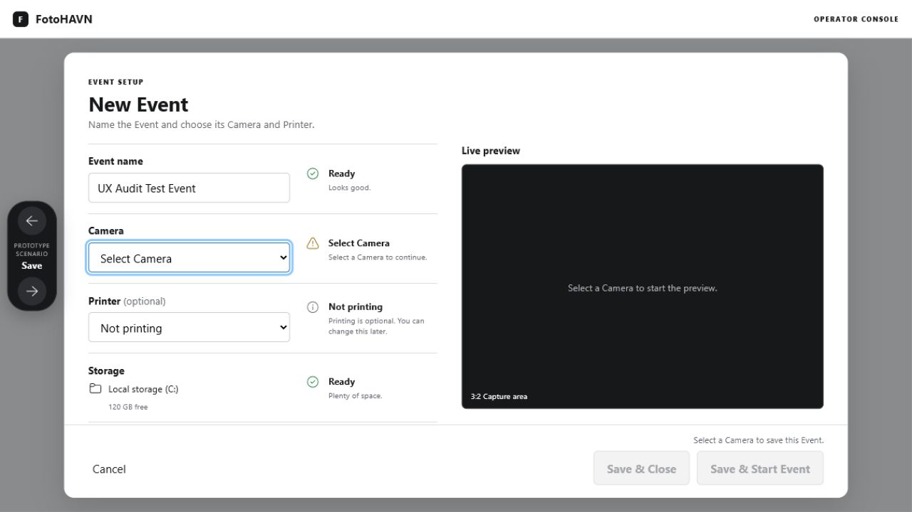
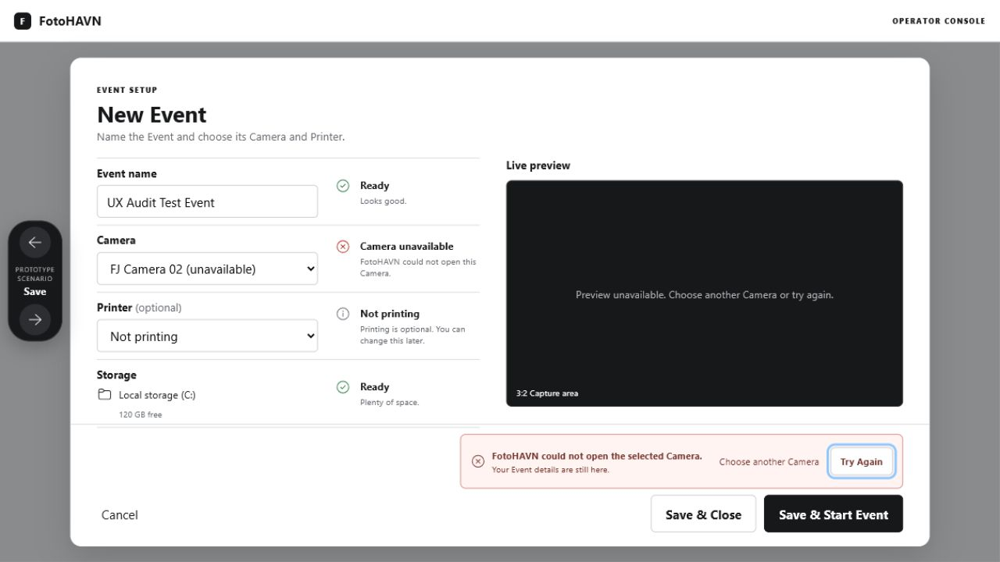
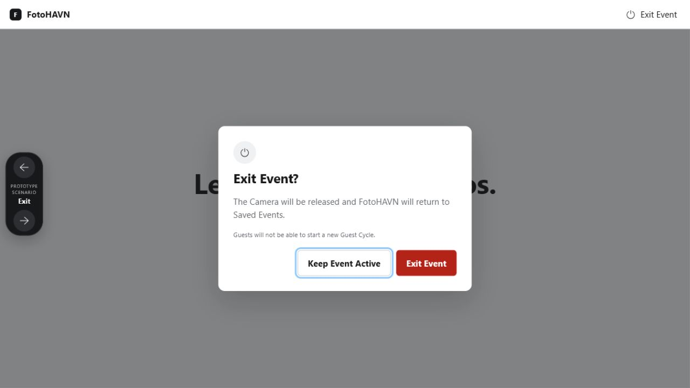
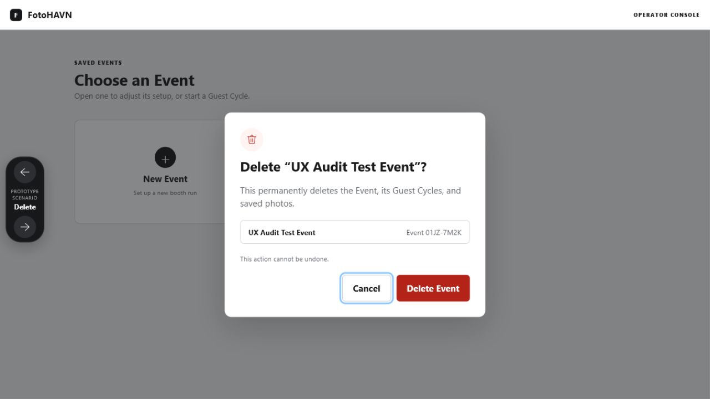
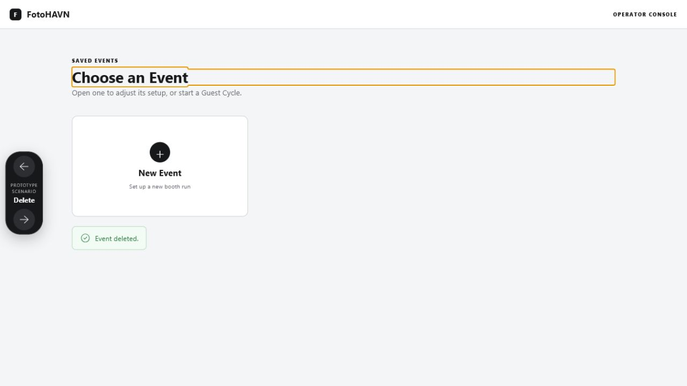

# FotoHAVN prototype audit — fixed state

Date: 2026-08-06  
Surface: Setup readiness and delayed-action feedback prototype  
Canonical viewport: 1280 × 720

## Overall verdict

The five audited operator steps are healthy after the fix pass. The prototype now keeps the selected field-anchored design, makes the primary Event task visible, preserves layout during recovery, and behaves correctly for keyboard-accessible confirmations. No actionable P0/P1/P2 findings remain in the audited prototype scope.

## Numbered flow

### 1. Choose and start an Event — healthy

The saved Event card now exposes visible 48 × 48 Edit/Delete controls, a compact readiness summary, and a persistent Start Event action. New Event retains immediate local busy feedback.

### 2. Resolve setup readiness — healthy

The selected Camera receives visible focus without scrolling the heading out of view at high zoom. Each readiness status remains attached to its field, Printer stays explicitly optional, and the footer explains blocked actions.

### 3. Recover from failed Start — healthy

The Camera status now changes truthfully to `Camera unavailable`; the preview explains why it is unavailable; the layout shrinks cleanly rather than colliding with the footer; and focus moves to Try Again. Choose another Camera returns focus to the Camera selector.

### 4. Exit an Active Event — healthy

The safe action receives focus on open. Tab and Shift+Tab stay inside the dialog, Escape and Keep Event Active close it, background content and prototype controls are inert/hidden, and focus returns to Exit Event.

### 5. Delete an Event — healthy

Cancel works and receives initial focus. Successful deletion closes the dialog, removes the Event card, announces `Event deleted`, and moves focus to the confirmation.

## Fixed findings

- Added persistent Start/Edit/readiness affordances to the saved Event card.
- Reworked failed-Start sizing and truthful Camera/preview feedback.
- Added safe initial focus, focus containment, Escape, background isolation, and focus restoration to Exit/Delete dialogs.
- Completed Cancel/Keep Event Active interactions.
- Added Save and Delete success destinations with non-blocking confirmation.
- Prevented Camera autofocus from shifting the setup heading off-screen under zoom.

## Verification

- Canonical 1280 × 720 browser rendering captured and inspected.
- 1024 × 768, 150%-equivalent, and 200%-equivalent stress layouts have no horizontal document overflow; recovery controls remain reachable through vertical scrolling.
- Open, Edit, Start, Cancel, Save & Close, Start failure/retry, Exit, and Delete flows were exercised.
- Browser console reported no errors.
- Screenshots/DOM checks do not establish formal WCAG conformance or Narrator speech quality; those remain production WinUI verification tasks.
