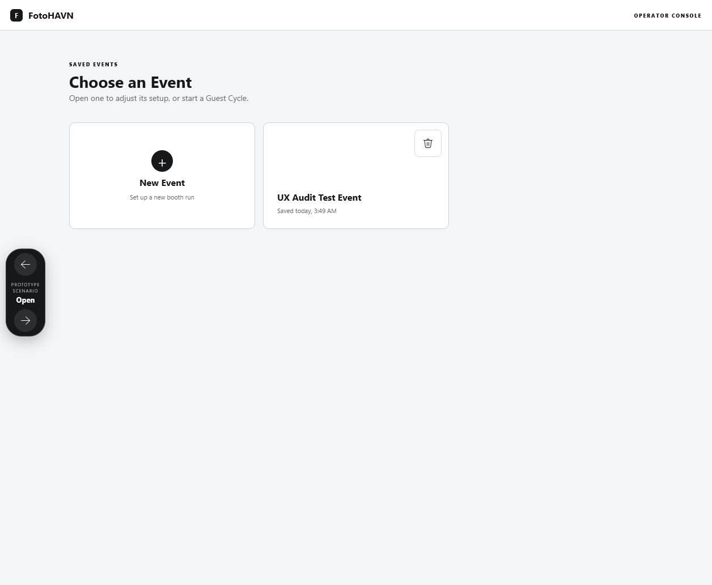
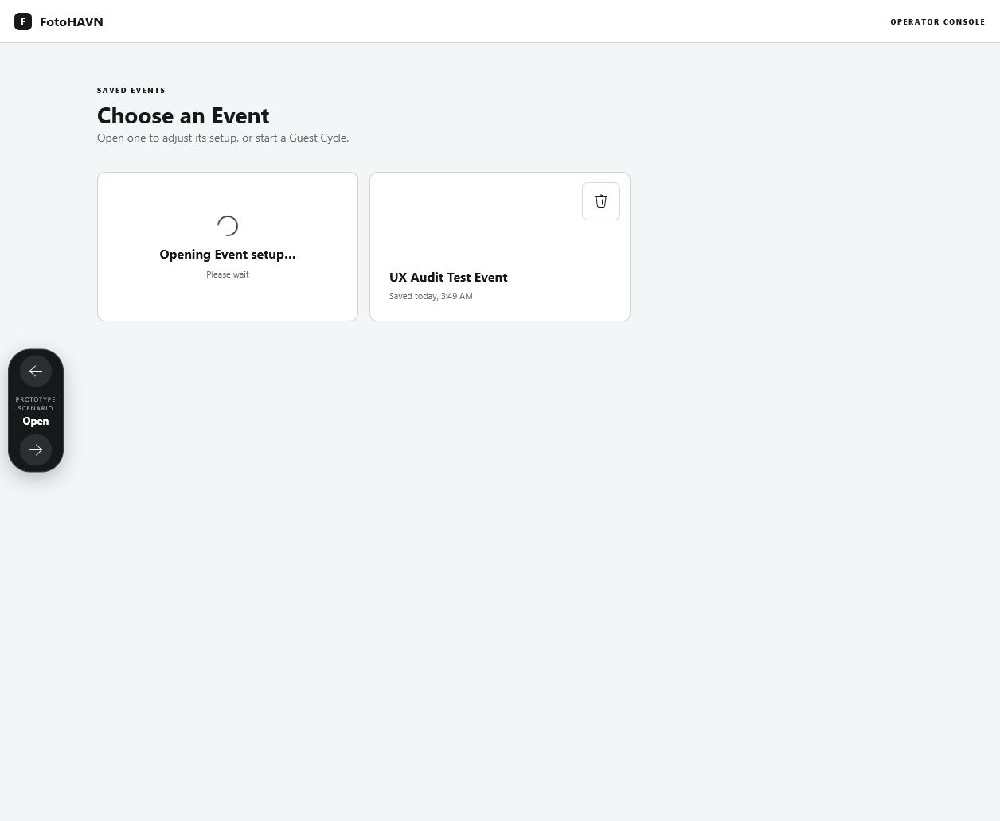
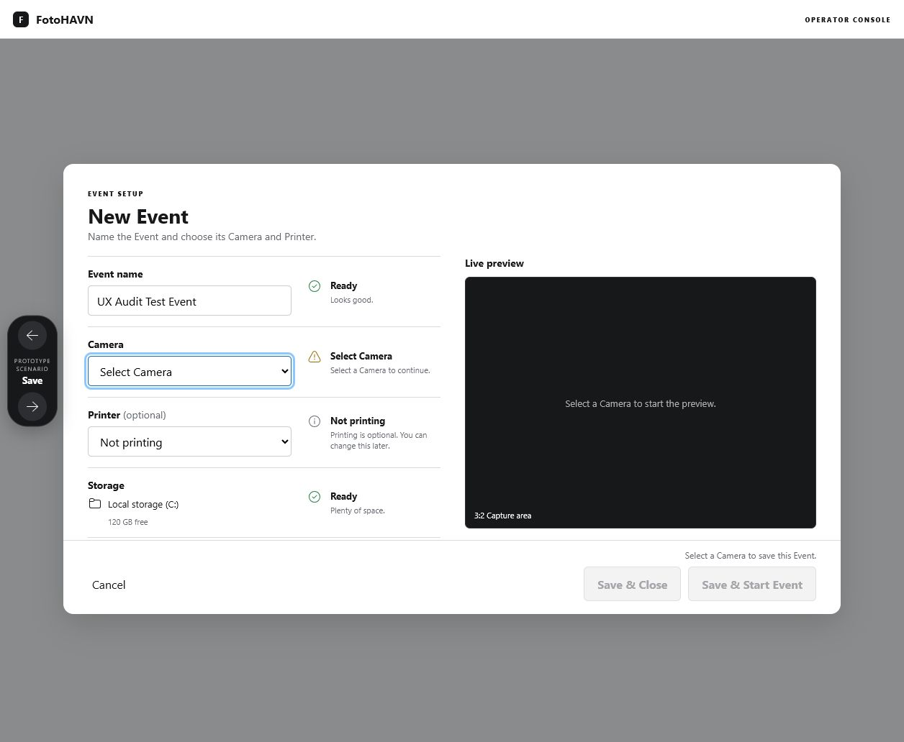
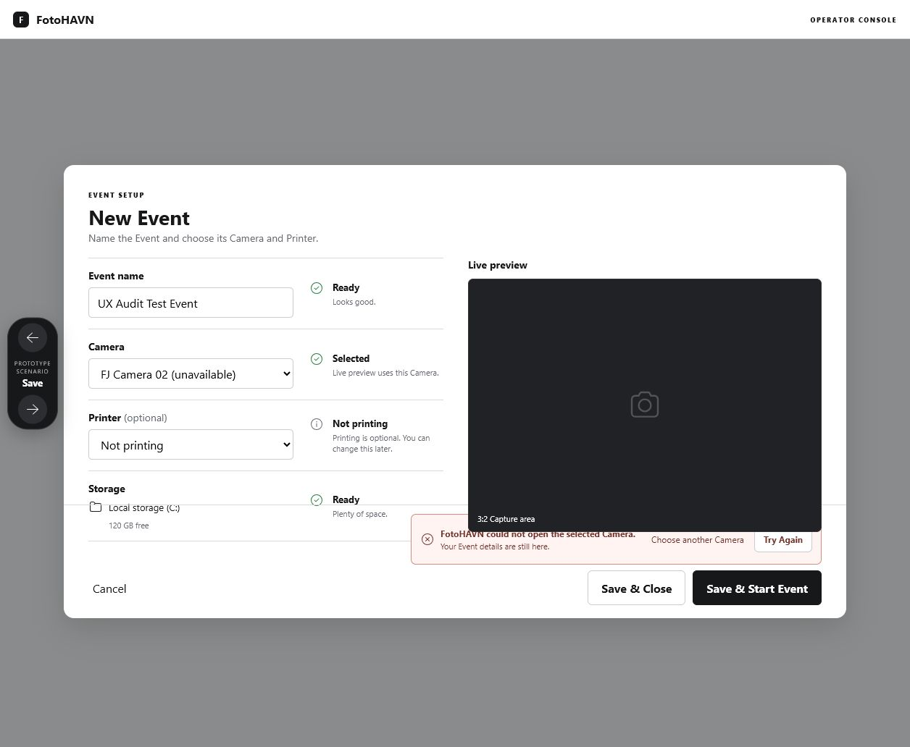
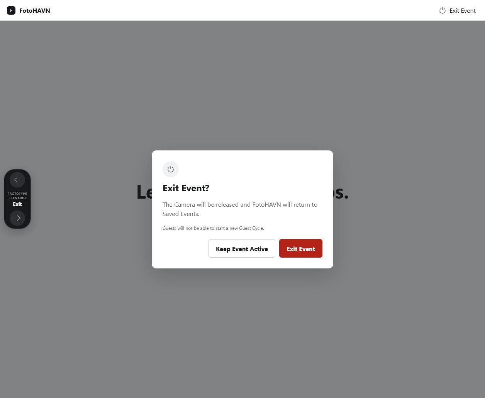
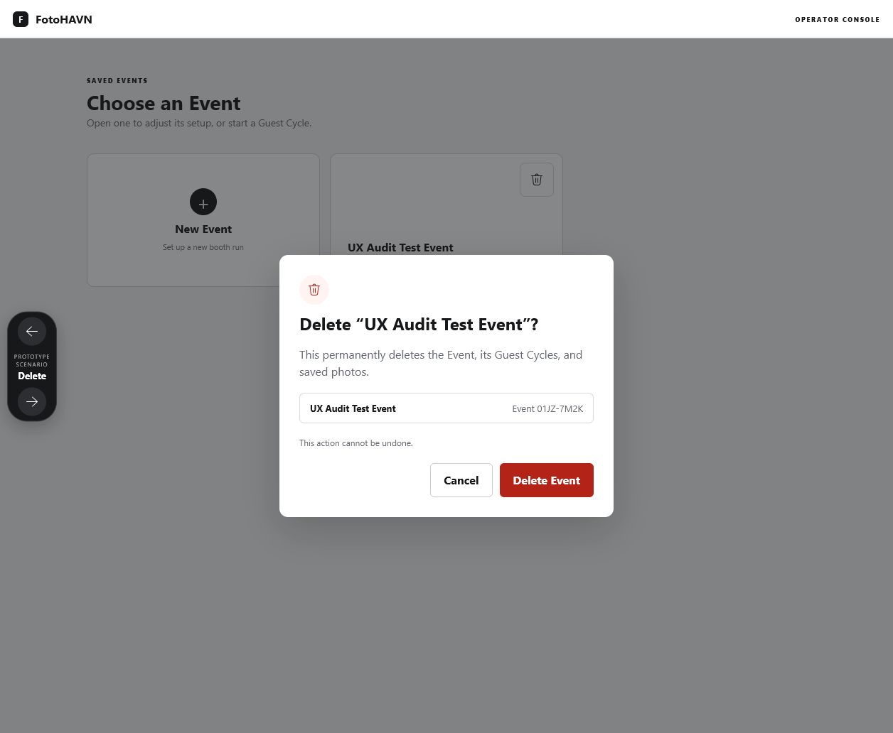

# FotoHAVN prototype combined UX and accessibility audit

Date: 2026-08-06  
Surface: Setup readiness and delayed-action feedback prototype  
Viewport: 1256 × 1032 (live in-app browser capture before canonical-frame normalization)

## Audit scope

The operator flow across opening Event setup, resolving setup readiness, recovering from a failed Start, exiting an Active Event, and deleting an Event. Evidence comes from screenshots and live DOM/keyboard inspection captured in this audit run.

## User goal and accessibility target

An operator should always know whether FotoHAVN is ready, why an action is blocked, what delayed action is running, and how to recover without losing context. The prototype should support visible keyboard focus, modal isolation, 48 × 48 touch targets, readable status communication, and assistive-technology-friendly state changes.

## Strengths

- Readiness is attached to the field it describes instead of being hidden behind disabled actions.
- `Printer (optional)` defaults to `Not printing` and is communicated neutrally.
- Open, Save, Start, Exit, and Delete use stable labels and local progress rather than a global loading banner.
- Start failure retains the Event name, Camera, Printer, and storage context.
- Exit and Delete confirmations use clear plain-language consequences and consistent action hierarchy.
- Delete repeats the Event name and stable short identifier.

## Numbered flow

### 1. Open Event setup — needs work

The New Event action gives immediate, legible busy feedback. The saved Event card itself does not expose a visible Start action, edit action, or readiness summary, so the operator cannot predict readiness or begin the primary task from the resting card.

### 2. Resolve setup readiness — healthy

The left/right separation is calm and easy to scan. Camera receives focus because it is the blocking field; the footer explains why both save actions are disabled. The optional Printer and storage states are clear. Secondary status copy is small and should be checked at the required scaling references.

### 3. Recover from failed Start — poor

The failure retains context and offers Retry plus Choose another Camera. However, the error panel collides with the live preview/footer boundary, compresses several controls into one row, and makes the footer feel unstable. The unavailable Camera is still labeled `Selected` with `Live preview uses this Camera`, which contradicts the error. Focus is not moved to the recovery choice.

### 4. Exit Active Event — needs work

The dialog hierarchy and consequence copy are clear. On open, focus remains on the document body, the guest screen remains exposed to the accessibility tree, and the safe `Keep Event Active` action does not close the prototype dialog. Escape and focus containment are not implemented.

### 5. Delete Event — needs work

The destructive hierarchy, identity panel, and irreversible warning are strong. It shares the same modal focus/isolation problems as Exit; Cancel does not close the dialog. After success, the modal remains open instead of returning to the Event list with the deleted card removed and a short confirmation.

## Highest-impact findings

1. **P1 — Start recovery layout breaks at the moment confidence matters most.** Shrink the preview with the available content row, move Camera failure into the Camera status, and keep footer recovery actions in a stable, wrapping layout.
2. **P1 — Confirmation dialogs do not behave as dialogs.** Focus the safe action on open, trap Tab/Shift+Tab, support Escape, isolate background content, restore focus, and make Cancel/Keep Event Active functional.
3. **P1 — Saved Events hides the primary Start task.** Add a persistent Start Event action and compact readiness summary to the card, plus a visible Edit action.
4. **P2 — Delete success has no destination.** Close the modal, remove the deleted card, and show a short non-blocking confirmation.
5. **P2 — Unavailable Camera status is contradictory.** Change the field status to `Camera unavailable` and explain that no preview is available.

## Evidence limits and verification gaps

- Screenshots and DOM inspection can confirm visible hierarchy, labels, focus placement, and background exposure, but not Narrator speech quality or physical touch accuracy.
- Contrast is reviewed from declared tokens and visible output; formal WCAG measurement remains an implementation check.
- Real Camera, printer, filesystem, and timing behavior are intentionally simulated.

## Recommended fix order

1. Correct modal interaction and background isolation.
2. Repair Start error layout and Camera status truthfulness.
3. Add persistent saved-card Start/Edit/readiness affordances.
4. Complete Delete success transition.
5. Recheck 1280 × 720, 1024 × 768, 125%/150%, and 200%-zoom-equivalent layouts, then rerun design QA.
