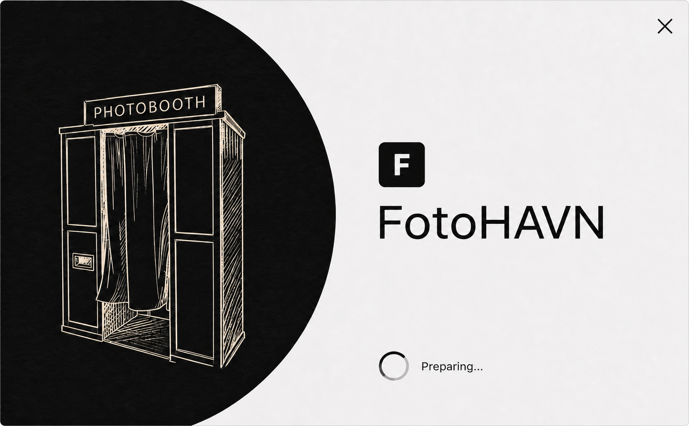

# Startup splash composition prototype

Status: Approved visual direction for [Prototype the startup splash composition](https://github.com/quinjan/FotoHAVN/issues/90) on 2026-08-11.

This folder preserves the reaction artifact used by [Map the FotoHAVN startup loading screen](https://github.com/quinjan/FotoHAVN/issues/89). It is planning evidence, not a production implementation or an approved addition to the FotoHAVN design contract.

## Approved reference

The composition targets a compact 680 × 420 effective-pixel, centered, borderless splash window:

- a cropped near-black circular photographic field anchors the left side;
- an ivory vintage-photobooth line illustration sits inside that field;
- the existing square `F` mark and `FotoHAVN` wordmark form the identity stack on the right;
- a subtle indeterminate ring accompanies the status `Preparing...`;
- a quiet close affordance occupies the upper-right corner;
- no supporting label, version, percentage, fabricated progress, or additional copy is shown.

Lifecycle, close behavior, failure/recovery, transition, motion, accessibility, design-contract integration, and verification remain separate wayfinding decisions.
