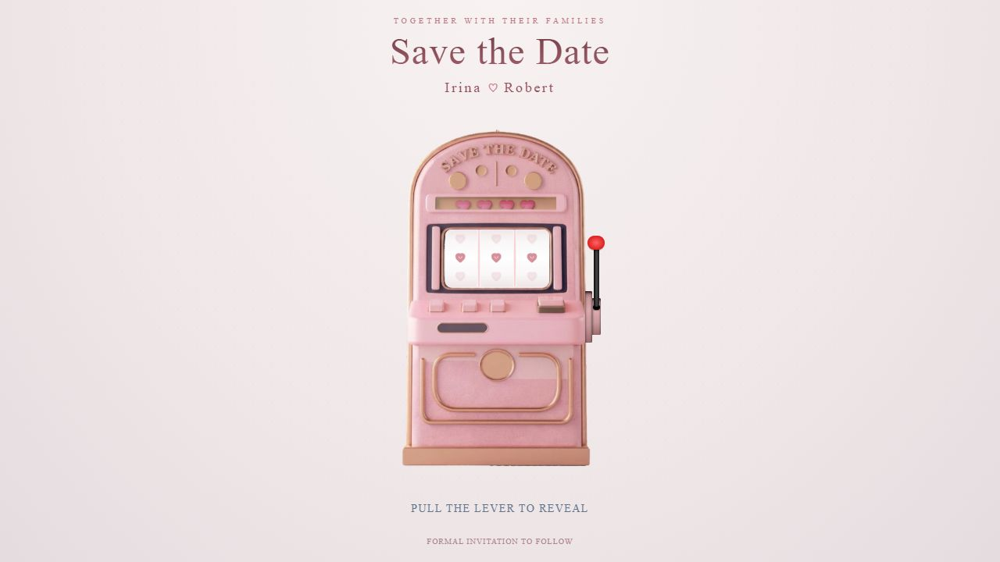
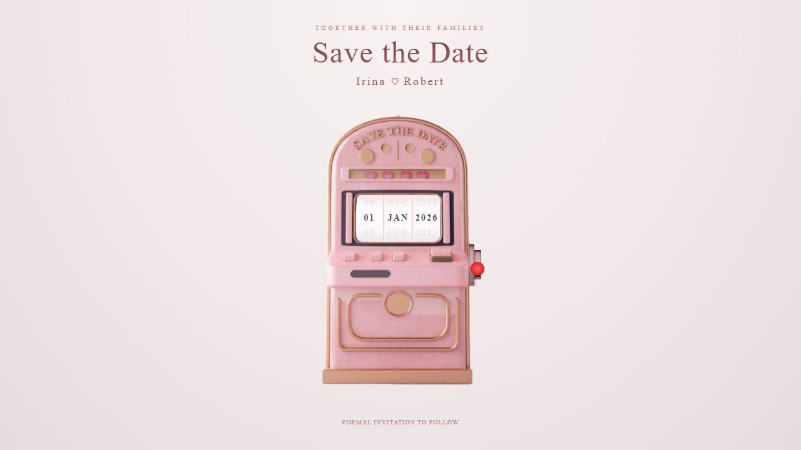
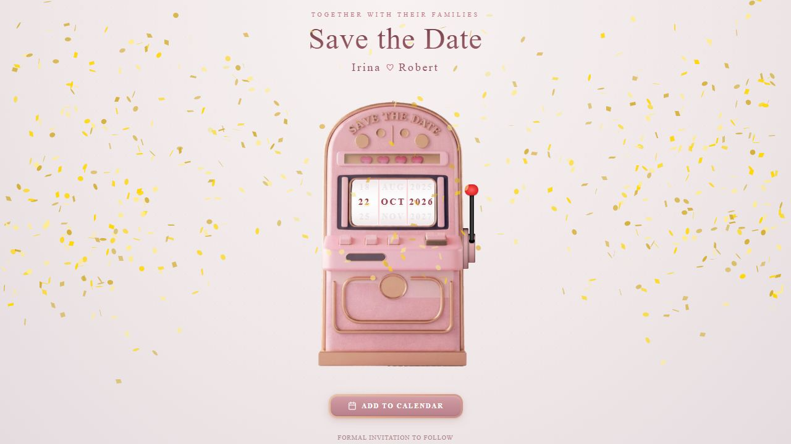
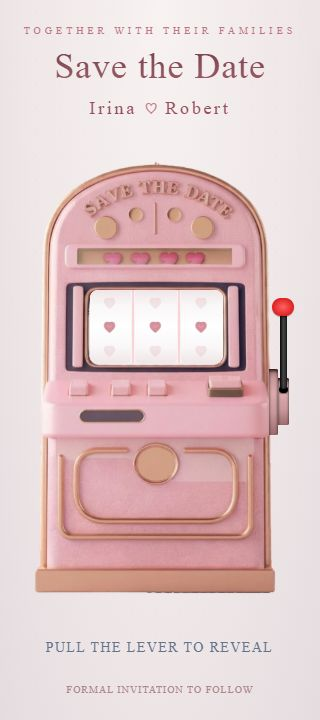

# FOTOHVN Interactive Pre-Landing: Reference Analysis and Product Specification

**Research date:** 2026-08-23  
**Reference:** [Save the Date slot-machine experience](https://savethedate-slot-machine.thedigitalinvite.com/)  
**Scope:** Read-only analysis of the live reference, its first-party shipped assets/code, and fit with FOTOHVN's canonical local design sources. No production website files were changed.

## Executive decision

**Recommendation:** add an optional, once-per-session interactive pre-landing experience, but adapt only the reference's **single action -> anticipation -> reveal -> clear next action** pattern. Do not reproduce the pink slot machine, wedding-template copy, confetti, glossy metallic effects, or 3.8-second reel sequence.

For FOTOHVN, the most coherent concept is **“Develop the photograph”**: the visitor presses a real semantic control, a photographic strip resolves from latent/soft detail to a finished FOTOHVN image in no more than the approved 600 ms reveal duration, and an `ENTER FOTOHVN` action hands focus and scroll cleanly to the existing branding-site hero. The interaction should feel like a tactile photographic ritual, not a game of chance.

This follows the brand's light-led, warm, tactile, photography-first direction and its requirement to feel nostalgic without becoming ornate or costume-like ([`website/DESIGN.md`](../website/DESIGN.md):3-9). It also respects the explicit ban on confetti, wedding-template styling, party graphics, metallic gradients, and novelty-filter framing ([`website/DESIGN.md`](../website/DESIGN.md):20,40-48,87-94,379-400).

## Evidence labels

- **Verified observation** — seen in the live page during this research run or read directly from its shipped first-party HTML/CSS/JavaScript/assets.
- **Inference** — a reasonable interpretation of the observed experience, not a statement from the reference owner.
- **Recommendation** — proposed FOTOHVN product/design behavior grounded in the local design authority.

## Research method and evidence

The live flow was inspected at a desktop viewport of **1280 x 720** and a narrow viewport of **320 x 720**. The initial and revealed states were visually captured and inspected during this run. The visible DOM/accessibility snapshot, computed geometry, and shipped first-party JavaScript/CSS were also inspected. Public web search returned no indexed results for this microsite, so direct live inspection and first-party assets are the primary evidence.

### Current-run screenshot evidence

The screenshots below are saved with this report and are the visual evidence for the numbered flow.

**Step 1 — idle, desktop (health: visually clear; inaccessible trigger)**



**Steps 2-3 — lever pulled and reels spinning, desktop (health: clear anticipation; long wait)**



**Step 4 — final reveal, desktop (health: legible reward; excessive decorative motion for FOTOHVN)**



**Step 1 — idle, 320 px mobile (health: core content visible; fixed artwork exceeds the viewport)**



**Step 4 — final reveal, 320 px mobile (health: CTA visible; artwork/particle density and sizing remain problematic)**


Primary web sources:

- [Live reference experience](https://savethedate-slot-machine.thedigitalinvite.com/)
- [Shipped JavaScript bundle](https://savethedate-slot-machine.thedigitalinvite.com/assets/index-D5TFjp5G.js)
- [Shipped CSS bundle](https://savethedate-slot-machine.thedigitalinvite.com/assets/index-Kt88vZQs.css)
- [Slot-machine shell PNG](https://savethedate-slot-machine.thedigitalinvite.com/assets/slot-machine-shell-CLq4SuYa.png)
- [Reveal audio MP3](https://savethedate-slot-machine.thedigitalinvite.com/sounds/reveal.mp3)

Canonical FOTOHVN sources inspected:

- [`website/DESIGN.md`](../website/DESIGN.md)
- [`website/tokens.json`](../website/tokens.json)
- [`website/variables.css`](../website/variables.css)
- [`website/theme.css`](../website/theme.css)

## Reference experience: mechanics and flow

### Numbered states

| Step | State | Verified behavior | General health |
|---:|---|---|---|
| 1 | Page loaded / idle | A centered wedding heading, couple names, large slot-machine image, three heart-filled reels, “Pull the lever to reveal,” and “Formal invitation to follow” are visible. | Visually clear; interaction semantics are poor. |
| 2 | Lever activated | Clicking the custom lever changes it to a pulled pose for 500 ms, starts the audio, and changes the experience to `spinning`. Further lever clicks are suppressed while spinning. | Pointer behavior is understandable visually; keyboard access is absent. |
| 3 | Reels spinning | Each reel cycles through values every 60 ms. Day stops at 1.5 s, month at 2.5 s, and year at 3.5 s. | Creates anticipation, but the wait is long for a gateway screen. |
| 4 | Reveal | At 3.8 s the state becomes `revealed`, the date reads `22 OCT 2026`, a gold confetti burst begins, and an “Add to Calendar” button fades/vibrates into view. | Reward is legible; motion is excessive for FOTOHVN and lacks a reduced-motion implementation. |
| 5 | Calendar action | The button uses the browser to download `save-the-date.ics`. The event is encoded as 22 October 2026, 12:00-23:59 UTC, with summary “Save the Date - Irina & Robert.” Supported devices are asked to vibrate `[100, 50, 100]`. | Useful outcome, but the calendar payload is minimal and was not imported end-to-end in this research. |
| 6 | Replay | Pulling the lever again after reveal stops/resets the audio and immediately starts the sequence again. | Replay exists but is not explained and adds no new outcome. |

### Observed copy and controls

**Verified observation**

- Eyebrow: `TOGETHER WITH THEIR FAMILIES`
- Heading: `Save the Date`
- Names: `Irina ♡ Robert`
- Prompt: `PULL THE LEVER TO REVEAL`
- Reveal: `22 OCT 2026`
- CTA: `ADD TO CALENDAR`
- Footer note: `FORMAL INVITATION TO FOLLOW`
- The machine shell is an image with alt text `Slot machine`.
- The lever is a clickable `<div id="slot-trigger">`, not a button or link. It has no accessible name, role, or `tabindex`.
- The post-reveal calendar control is a real `<button>` with accessible name `Add to Calendar`.

### Visual, motion, audio, and haptic details

**Verified observation**

- Composition is a centered, single-purpose, full-height page with large negative space and a strict top-to-bottom reveal hierarchy.
- The visual language is blush pink, cream, rose, and simulated gold. The background is a pale radial gradient with a very faint dot texture.
- Typography is almost entirely `Cormorant Garamond`; the page uses small, widely tracked uppercase labels around a larger serif heading.
- The machine uses a fixed **352 x 484 px** container. The PNG shell and DOM-rendered reel windows are layered together; the lever is built from styled DOM elements.
- The lever pull uses approximately 400 ms CSS transitions and returns from its pulled state after 500 ms.
- Reel values update every 60 ms, then settle in sequence at 1.5, 2.5, and 3.5 seconds; the final CTA appears after 3.8 seconds.
- The reveal launches an initial 100-particle gold confetti burst, then emits smaller bursts from both lower sides for approximately three seconds.
- `/sounds/reveal.mp3` is preloaded at page creation, set to 50% volume, rewound, and played on lever activation. Playback failures are silently ignored. There is no visible sound control.
- The calendar button uses a 0.5-second vibration animation after a 0.3-second delay, repeated three times. On supported devices, the calendar action also requests haptic vibration.
- The shipped CSS has no `prefers-reduced-motion` rule. The confetti call does not enable the library's reduced-motion disabling option.

### First-party asset inventory

**Verified observation**

| Asset | Raw size observed | Note |
|---|---:|---|
| JavaScript bundle | 323,637 B | Includes the experience logic and confetti implementation. |
| CSS bundle | 61,653 B | Includes the lever construction and utility styles. |
| Slot-machine shell PNG | 1,724,091 B | The dominant above-the-fold artwork; large for a gateway experience. |
| Reveal MP3 | 371,983 B | Preloaded by the shipped JavaScript. |

No first-party font file, `@font-face`, or font import was found in the inspected page inventory/CSS. The requested `Cormorant Garamond` therefore depends on it already being available or falls back to a generic serif.

**Inference**

The experience succeeds because it gives the visitor one obvious task and delays the meaningful information until the physical-looking machine completes its ritual. Its emotional model is “small effort, suspense, reward.” The machine itself is not the transferable idea; the transferable idea is the controlled sequence and the transformation of an initially unreadable/empty state into one memorable result.

## What transfers to FOTOHVN—and what does not

### Retain

**Recommendation**

- One dominant object or photographic composition.
- One primary interaction with a plain-language instruction.
- A short anticipation beat followed by a definite completed state.
- A single next action after the reveal.
- Generous whitespace and a calm, poster-like hierarchy.
- A replay affordance only if it serves a real purpose, such as showing another approved image—not as a hidden repeat gesture.

These are consistent with FOTOHVN's approved generous spacing, editorial hierarchy, flat surfaces, and restrained geometry ([`website/DESIGN.md`](../website/DESIGN.md):9,127-160,411-417).

### Replace

**Recommendation**

| Reference device | FOTOHVN adaptation |
|---|---|
| Pink slot machine | A real FOTOHVN booth/print photograph or purpose-made photographic development sequence. |
| Pull a decorative lever | A semantic 48 px-minimum `PRESS TO DEVELOP` or `DEVELOP THE STRIP` button, optionally visually integrated with a real photographed booth control. |
| Hearts and random reel values | One approved strip or image resolving into authored FOTOHVN photography; no suggestion of randomness or “filters.” |
| 3.8-second wait | A user-started reveal completed in **600 ms or less**, matching the canonical editorial reveal token. |
| Gold confetti | Quiet opacity/detail development, a maximum 16 px vertical reveal, and no ornamental particle system. |
| Pink/gold gradients and glossy bevels | Off-white, Warm Ivory, Cream Paper, Ebony/Dark Walnut, and precision Muted Brass details with flat/low-elevation treatment. |
| Wedding-template copy | Sensory FOTOHVN language about photographs, the enclosed booth, printed keepsakes, and entering the experience. |
| `Add to Calendar` | `ENTER FOTOHVN`; booking remains in the branding site's established hierarchy. |

The required materials are already codified: warm photographic paper and wood colors ([`website/DESIGN.md`](../website/DESIGN.md):69-94; [`website/tokens.json`](../website/tokens.json):3-114), Cormorant Garamond plus Manrope ([`website/DESIGN.md`](../website/DESIGN.md):96-125; [`website/tokens.json`](../website/tokens.json):116-243), and restrained motion tokens of 150/240/600 ms ([`website/tokens.json`](../website/tokens.json):327-343; [`website/variables.css`](../website/variables.css):119-123).

## Recommended FOTOHVN concept

### Concept: “Develop the photograph”

**Recommendation**

Initial screen:

- Eyebrow: `A FOTOHVN PHOTOGRAPH IS ABOUT TO DEVELOP`
- Main visual: one approved booth/print photograph in a restrained print frame, initially soft/latent but still understandable.
- Primary control: `PRESS TO DEVELOP`
- Secondary control: `SKIP INTRO`
- Optional quiet status: `SOUND OFF` / `SOUND ON`, with sound off by default.

Reveal:

- The approved photograph resolves cleanly within 600 ms.
- A small line appears: `ENCLOSED. PRINTED. DISTINCTIVE.`
- Primary completion action: `ENTER FOTOHVN`
- Optional text link: `REPLAY`

Handoff:

- The intro exits with a short opacity transition.
- The existing branding-site hero becomes the first page content and retains its approved headline, `PHOTOGRAPHS, DEVELOPED DIFFERENTLY.`
- Focus moves to the hero heading or the first meaningful hero control, not to the browser body.

This avoids repeating the hero headline inside the intro while still priming the three approved experience qualities. Those qualities already exist in the canonical content model as `ENCLOSED`, `PRINTED`, and `DISTINCTIVE` ([`website/DESIGN.md`](../website/DESIGN.md):212-215,254-258).

## Exact handoff into the main branding site

**Recommendation**

Do **not** make the pre-landing a separate mandatory URL in front of the real homepage. Keep the canonical homepage server-rendered at the root and layer the intro over it as progressive enhancement.

1. The server returns the complete normal FOTOHVN page and metadata.
2. A small client-side eligibility check decides whether the intro opens.
3. While open, the underlying `<main>` is `inert` and excluded from keyboard interaction; scrolling is controlled without removing the main content from the document response.
4. `SKIP INTRO`, `ENTER FOTOHVN`, asset failure, or a safety timeout all close the layer.
5. Closing removes `inert`, restores scroll, records `introSeen=true` in `sessionStorage`, and moves focus to the main hero heading or CTA.
6. Deep links, hash links, and non-root routes bypass the intro. A development/replay query such as `?intro=1` may force it for review.
7. Search crawlers and no-JavaScript users receive the ordinary homepage without a gate.

### Recommended entry policy

- Show once per **browser session**, not on every page load.
- Always expose `SKIP INTRO` immediately.
- Never autoplay the interaction.
- Never trap a visitor longer than the interaction itself; use a fallback timeout that reveals `ENTER FOTOHVN` if an asset or animation fails.
- Do not show it on deep links, inquiry/booking routes, or returning navigation within the same session.
- Treat persistent “show once ever” storage as an optional later decision; session scope is easier to test and less surprising.

## FOTOHVN state machine and interaction specification

| State | Visible experience | Allowed events | Required system behavior |
|---|---|---|---|
| `checking` | Normal server-rendered homepage; no flash of a half-built intro. | eligibility result | Decide from route, session flag, reduced-data rule, and explicit `?intro=1`. |
| `idle` | Intro visual, `PRESS TO DEVELOP`, `SKIP INTRO`, optional sound preference. | `START`, `SKIP`, `ASSET_ERROR` | Focus is visible; underlying main is inert; no audio or motion has started. |
| `developing` | Short authored photographic reveal; control indicates busy. | `REVEAL_END`, `SKIP`, `TIMEOUT` | Disable duplicate activation; expose `aria-busy="true"`; finish within 600 ms. |
| `revealed` | Finished photograph, `ENCLOSED. PRINTED. DISTINCTIVE.`, `ENTER FOTOHVN`, optional `REPLAY`. | `ENTER`, `REPLAY`, `SKIP` | Announce completion politely without reading every animation frame. |
| `exiting` | Intro fades out. | transition end or timeout | Duration 240 ms max; reduced motion exits immediately. |
| `done` | Existing homepage hero. | normal site events | Remove inert/scroll lock, record session completion, focus the hero target. |
| `fallback` | Static brand image plus `ENTER FOTOHVN` and `SKIP INTRO`. | `ENTER`, `SKIP` | No animation/audio dependency; always usable with missing assets or script failure. |

### State-transition rules

```text
checking -> idle       eligible
checking -> done       ineligible, deep link, or prior session completion
idle -> developing     START
developing -> revealed REVEAL_END or reduced-motion immediate completion
revealed -> developing REPLAY
idle/developing/revealed/fallback -> exiting  SKIP or ENTER
exiting -> done        transition end or safety timeout
idle/developing -> fallback  asset/animation failure
```

### Suggested analytics events

Collect only aggregate interaction data and do not block the experience on analytics:

- `intro_view`
- `intro_start`
- `intro_complete`
- `intro_skip` with state (`idle` or `developing`)
- `intro_enter`
- `intro_replay`
- `intro_fallback`

## What the FOTOHVN team needs to provide

### Content

1. Final eyebrow/instruction copy.
2. Final primary labels for start, skip, enter, and replay.
3. The reveal line—recommended: `ENCLOSED. PRINTED. DISTINCTIVE.`
4. Optional one-sentence accessible description of what visually develops.
5. A decision on whether the intro names FOTOHVN immediately or reveals the name at completion.

### Visual assets

1. One approved FOTOHVN hero/booth photograph suitable for both desktop and mobile editorial crops, or a purpose-made intro photograph.
2. If a strip sequence is used, the final approved strip plus any deliberately authored intermediate frames; do not synthesize the visible machine with CSS shapes.
3. Approved FOTOHVN wordmark/logo files if the intro uses a mark.
4. Image focal-point/crop instructions for 320 px mobile, tablet, and wide desktop.
5. Rights/usage confirmation for every photograph and audio asset.

The local authority prioritizes the full enclosed booth, guests entering/inside it, printed strips, and tactile booth details, and requires real or purpose-made photography rather than blank or unrelated stock imagery ([`website/DESIGN.md`](../website/DESIGN.md):162-184,402-409).

### Optional audio

1. A short owned/licensed shutter, mechanism, or print-development sound.
2. Approved loudness and maximum duration.
3. Whether sound is off by default (recommended) or explicitly enabled before start.
4. Text labels for the sound preference.

### Product rules

1. Once per session versus every visit (once per session recommended).
2. Whether `SKIP INTRO` is always visible (yes recommended).
3. Whether replay changes the image or simply repeats the same reveal.
4. Which routes bypass the intro.
5. The safety timeout and asset-failure behavior.
6. Analytics events and retention policy.
7. Whether marketing campaigns need a direct “replay intro” link.

### Fallback and accessibility copy

1. Static fallback label and image alt text.
2. Screen-reader completion announcement.
3. Plain-language reduced-motion behavior.
4. A no-JavaScript path that goes directly to the main site.

## Responsive and mobile considerations

### Reference findings

**Verified observation**

At a **320 px viewport**, the reference retains the fixed 352 px machine. The measured machine was **352 x 484 px** at `x = -23.5 px`, with its right edge at `328.5 px`. The page measured **329 px `scrollWidth`**, nine pixels wider than the 320 px viewport. In the in-app capture, the measured document `clientWidth` was **305 px** because the browser scrollbar occupied client area; against that document client width the overflow was 24 px. A horizontal scrollbar was visible, the lever remained onscreen, and the machine was clipped. In the revealed state, the calendar button measured approximately **216.6 x 38.8 px**, below FOTOHVN's 48 px control minimum and the local accessibility guidance of at least 44 px.

### FOTOHVN requirements

**Recommendation**

- Design and test at **320, 375, 390, 768, 1024, and 1280 px**.
- Give the interactive visual a fluid inline size such as `min(100%, <approved max>)`; do not preserve a desktop intrinsic width on mobile.
- Keep at least 24 px mobile gutters, aligned with the canonical tokens ([`website/tokens.json`](../website/tokens.json):260-292; [`website/variables.css`](../website/variables.css):93-101).
- Keep primary and skip controls fully visible without horizontal scrolling.
- Use 48 px minimum control height, matching the canonical component token ([`website/tokens.json`](../website/tokens.json):345-352; [`website/variables.css`](../website/variables.css):125-128).
- Verify `scrollWidth === clientWidth` at every narrow viewport.
- Preserve the image's focal subject and avoid shrinking it into an unreadable thumbnail.
- Account for short mobile heights, browser chrome, landscape orientation, and safe-area insets; the intro must scroll vertically if content cannot fit.
- Never hide overflow as the fix for an intrinsically oversized visual.

## Accessibility requirements

### Reference risks

**Verified observation**

- The only control that starts the core task is a generic clickable `<div>` without button semantics, keyboard focus, or an accessible name.
- The visual instruction says to pull a lever, but no equivalent semantic action is exposed in the accessibility snapshot.
- Reel state changes are generic text and are not announced as a coherent final date.
- There is no visible skip option before the 3.8-second sequence completes.
- The shipped CSS does not implement `prefers-reduced-motion`.
- The 320 px result overflows horizontally, and the revealed CTA is under 44 px tall.
- The page uses 10 px tracked labels for several important context lines, creating a readability risk.

### FOTOHVN requirements

**Recommendation**

- Use a real `<button>` for the primary interaction. The photographed control may be decorative, but it must not be the only hit target.
- Give every action a 48 px minimum target and the approved 2 px focus ring with 3 px offset ([`website/DESIGN.md`](../website/DESIGN.md):192-198,368-377; [`website/variables.css`](../website/variables.css):103-117).
- Support Enter and Space; do not require dragging, swiping, pointer precision, or device motion.
- Keep `SKIP INTRO` in the keyboard order from the beginning.
- Use `aria-busy` while developing and one polite live-region announcement after completion.
- Apply `inert` to the underlying main only while the intro is active; restore it before moving focus into the main site.
- Respect `prefers-reduced-motion`: remove transforms, particles, vibration, and staged waiting; complete immediately or nearly immediately. The canonical CSS variables already collapse motion durations under that preference ([`website/variables.css`](../website/variables.css):136-141).
- Do not make audio necessary for understanding. Provide an explicit sound preference if audio is included.
- Do not convey completion by color or blur alone; pair the visual change with visible text and an announced state.
- Test keyboard-only operation, screen-reader reading/focus order, 200% zoom, Windows High Contrast/forced colors, and touch target behavior before acceptance.

Standards/background references: [WCAG 2.2](https://www.w3.org/TR/WCAG22/), including keyboard operation (2.1.1) and target size (2.5.8); [W3C guidance for animation from interactions](https://www.w3.org/WAI/WCAG22/Understanding/animation-from-interactions); and [MDN `prefers-reduced-motion`](https://developer.mozilla.org/en-US/docs/Web/CSS/@media/prefers-reduced-motion).

## Performance and resilience

**Recommendation**

- Reuse an approved hero/booth image where practical so the intro and main hero do not compete to download two large above-the-fold assets.
- Prefer responsive AVIF/WebP with width/height reserved to prevent layout shift; keep the original only as a fallback.
- Keep the intro logic in a small isolated client component rather than moving the entire homepage to client rendering.
- Load optional audio only after eligibility is known; do not preload audio for visitors who will bypass the intro.
- Avoid a canvas particle/confetti library and avoid a large animation runtime for a single reveal.
- Provide a static fallback immediately if the main visual fails.
- Do not make analytics, storage, audio, or animation completion prerequisites for `ENTER FOTOHVN`.
- Measure Largest Contentful Paint, Interaction to Next Paint, Cumulative Layout Shift, total JavaScript, and image transfer size on a throttled mobile connection.
- Reserve all layout geometry up front and ensure the intro's exit does not shift the main page underneath.

Implementation background: [MDN `sessionStorage`](https://developer.mozilla.org/en-US/docs/Web/API/Window/sessionStorage), [web.dev: Optimize LCP](https://web.dev/articles/optimize-lcp), and [web.dev: Image performance](https://web.dev/learn/performance/image-performance).

## Risks and trade-offs

| Risk | Why it matters | Mitigation |
|---|---|---|
| Gateway friction | Every extra action can increase bounce and delay inquiry intent. | Show once per session, keep `SKIP INTRO` visible, finish reveal within 600 ms, and bypass on deep links. |
| Novelty overtakes the brand | A game-like machine can make FOTOHVN feel like a party supplier or gimmick. | Use authored photography and print development; no slot machine, chance language, confetti, or faux metal. |
| Duplicate hero message | Repeating the hero headline twice weakens the handoff. | Intro reveals `ENCLOSED. PRINTED. DISTINCTIVE.`; main hero keeps the approved brand headline. |
| Accessibility exclusion | A pointer-only decorative control blocks the core path. | Real button, visible skip, focus management, reduced motion, live announcement, static fallback. |
| Mobile overflow | Fixed visual dimensions create clipping and horizontal scroll. | Fluid container, focal crops, 320 px-first QA, explicit `scrollWidth` check. |
| Performance regression | A second full-screen image/audio/animation bundle competes with the actual homepage. | Reuse assets, responsive formats, isolated small component, lazy optional media, no particle library. |
| Audio surprise | User-triggered audio can still be unexpected in a quiet environment. | Sound off by default or explicit opt-in; never make it required. |
| Repeat annoyance | Showing the intro every visit makes navigation feel slower. | Session flag; replay available by explicit link/query only. |
| SEO/content obscuration | A separate client-only gateway can hide the real homepage from crawlers and no-JS users. | Keep the complete homepage server-rendered at `/`; intro is an optional layer only. |
| Fragile transition | A failed animation could trap the visitor. | Safety timeout plus immediately available skip/enter fallback. |

## Open decisions before design work

1. Is the pre-landing a once-per-session welcome, a campaign-only experience, or something every new visitor must see?
2. Is the recommended `Develop the photograph` metaphor approved, or should design exploration compare it with a `Step inside / draw the curtain` metaphor?
3. Which exact approved photograph or strip will carry the interaction?
4. Does the intro reveal `ENCLOSED. PRINTED. DISTINCTIVE.`, the FOTOHVN name, or another short outcome?
5. Are `PRESS TO DEVELOP`, `SKIP INTRO`, and `ENTER FOTOHVN` the right labels?
6. Is audio included, and if so, is it off by default?
7. Should replay show the same photograph or a second approved image?
8. Which routes and campaign links bypass or force the intro?
9. What analytics are required, and what is the acceptable intro-to-enter drop-off?
10. What performance budget is acceptable for the added image, JavaScript, and optional audio?
11. Who approves image rights, crop variants, sound rights, and final accessible copy?
12. Should the main hero be visually visible beneath/behind the intro during the transition, or should the intro exit to a clean full hero reveal?

## Suggested design-to-build sequence

1. Decide the entry policy and interaction metaphor.
2. Approve the exact intro copy and final handoff target.
3. Select/produce the real photographic assets and crop directions.
4. Create three visual directions for the intro using the canonical FOTOHVN system; choose one before implementation.
5. Specify the state machine, reduced-motion/static fallback, audio choice, and focus handoff.
6. Build the intro as an isolated progressive-enhancement layer without changing the main branding-site information architecture.
7. Run plan conformance before responsive QA, then test desktop plus 320/375/390 px, keyboard, reduced motion, clean console, overflow, and performance.

## Evidence limits

- This report is based on the reference as served on 2026-08-23; the owner can change its deployed assets and behavior later.
- Current-run screenshots are embedded above and stored under `research/reference-slot-machine/`; they establish only the captured viewport states, not behavior in untested browsers or devices.
- The shipped code establishes the calendar payload and download mechanism, but the downloaded `.ics` file was not imported into Apple, Google, or Outlook calendars.
- Audio asset availability and invocation were verified from the live source; audible quality and loudness were not judged in a controlled listening test.
- No real screen reader, switch-control device, Android haptic device, Safari browser, or iOS browser was tested. Accessibility findings are risks and implementation requirements, not a WCAG conformance claim.
- No throttled-network performance profile or Core Web Vitals trace was run.
- Asset ownership/licensing and the reference creator's design rationale were not available.
- The recommended FOTOHVN direction is a product/design proposal grounded in the four canonical local sources; it is not production authorization.

## Bottom line

The reference is useful as a **behavioral pattern**, not a visual template. Its strongest idea is the controlled reveal and immediate next step. FOTOHVN should translate that into a short photographic-development ritual, preserve an instant skip, complete the reveal within its 600 ms motion system, and hand focus directly into the existing homepage hero. The intro should deepen the brand's tactile photography promise without becoming a barrier, a wedding gimmick, or a second homepage.
