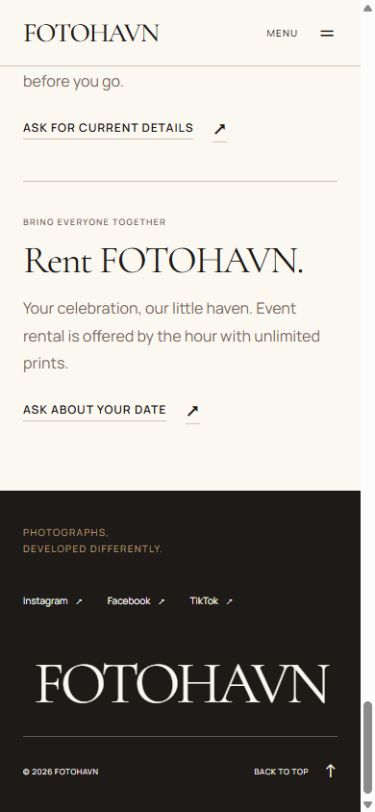
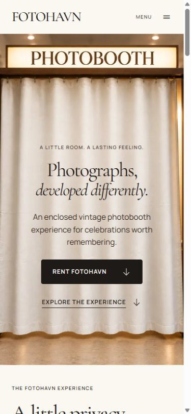
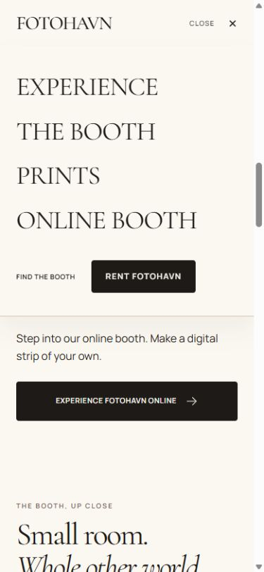
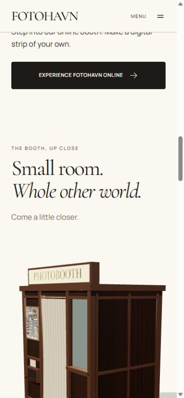
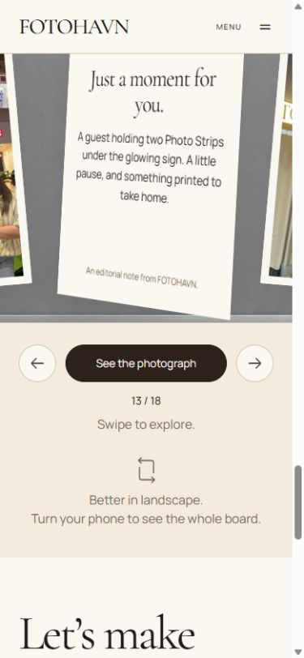
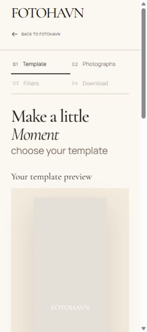
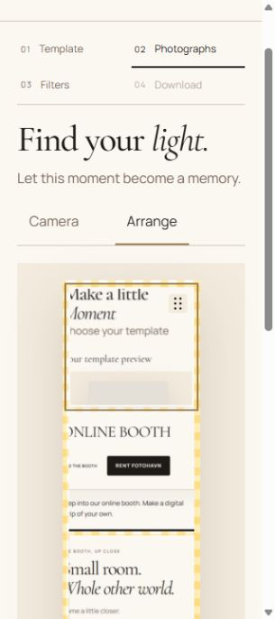
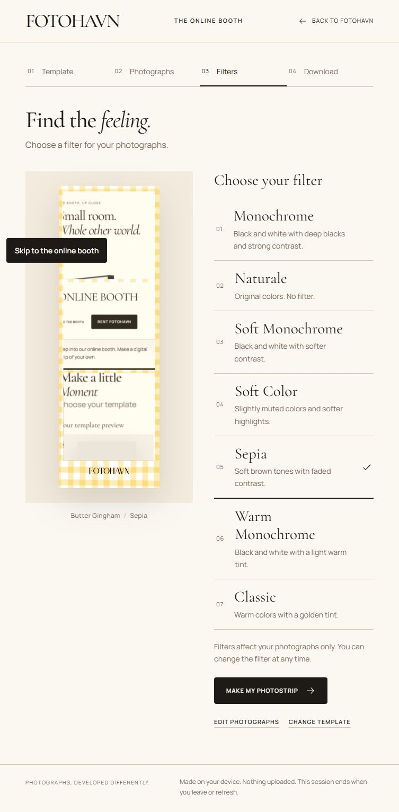
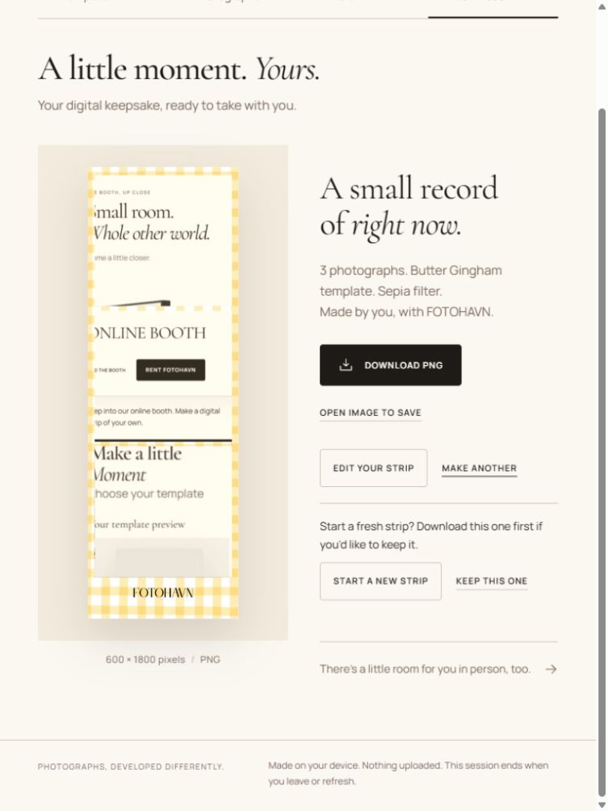
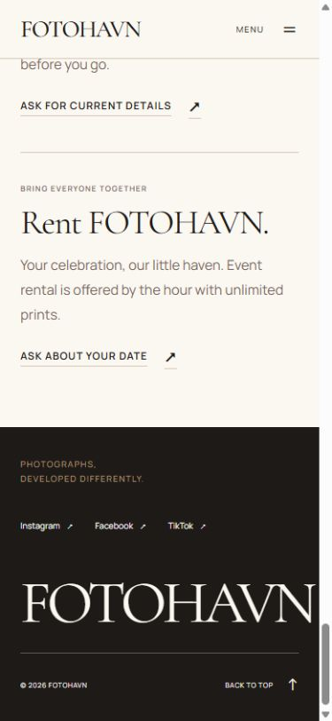

# FotoHAVN pre-merge QA — 15 September 2026

## Verdict: blocked

### Remediation update — 15 September 2026

The user requested fixes after the audit. Findings 1, 3, 4, and 5 are now fixed in the working tree; the original observations below remain as the audit record.

- **Caddy matcher:** `handle @fotohavn` now matches the declared name. Runtime Caddy validation remains outstanding: the Caddy binary is unavailable and the installed Docker client has no running engine.
- **Lint:** added a one-line, documented rule exception for the test fixture's simulated React dispatcher. Production hook rules remain enabled. `npm run lint` now passes.
- **Prints copy:** changed to “Leave with physical prints. Scan the QR code for digital copies, ready to share and keep.” Verified in rendered page content.
- **Footer:** made the footer an inline-size container and sized the wordmark with `min(19cqw, 305px)`, removing the mobile viewport-width override. Its text now fits the padded content width at 320, 390, 768, 1440, and 1920px; center offsets are within 0.008px of zero. Measurements are in `footer-alignment-fixed.json`; the 390px screenshot was saved and visually inspected below.
- **Related deployment smoke-check correction:** changed the old `FOTOHVN` expected marker to `FOTOHAVN` in the Actions workflow, deployment helper, and its fake HTTP test fixture. This prevents the current branding from failing the release health check.
- **Revalidation:** 63 focused tests, ESLint, production build (including TypeScript), and `git diff --check` pass. Build ran outside the sandbox restriction noted in the original audit. No dependency changes were needed.
- **Still open — finding 2:** public HTTPS origin is not configured. Asked the user for the intended hostname; no hostname has been supplied at the time of this update. The current raw-IP HTTP configuration is retained until a concrete destination is chosen. Do not claim deployed camera readiness.
- **Other release evidence still outstanding:** actual PNG file saving in a target browser, real-device camera/permission recovery, container/Caddy/VPS verification, and independent final review. These were validation gaps rather than confirmed code defects; this repair pass does not mark them passed.

No merge, publish, live-server configuration change, or deployment was performed.

One audit pass of the current working tree on `codex/website-real-booth-redesign`, based on HEAD `107e895a488747c56031136d77b9af31d48930dd` plus existing tracked and untracked changes. No production source changes, merge, publish, or deployment were performed. This is a sampled browser audit, not certification of every device or every state combination.

## Findings

1. **P1 — deployment Caddy matcher is undefined.** `deploy/fotohavn/fotohavn.caddy:2` declares `@fotohavn`, while line 4 references `@fotohvn`. Correct the reference and run Caddy validation before rollout. Static source finding; the Caddy binary was unavailable locally. [Caddy matcher contract](https://caddyserver.com/docs/caddyfile/matchers).
2. **P1 — the configured public staging origin cannot support normal browser camera access.** The Caddy site and deployment script target plain HTTP on `159.223.47.227`. Remote camera access needs HTTPS; localhost is a special secure-context exception. Provide HTTPS and verify camera permission/capture there before claiming the online booth works on deployment. Import remains an alternative, not validation of camera capture. This is a configuration finding, not a live VPS test. [Browser camera requirements](https://developer.mozilla.org/en-US/docs/Web/API/MediaDevices/getUserMedia).
3. **P2 — lint fails and blocks the publishing workflow.** `website/scripts/online-photobooth-preview.test.mjs:39:63`: `react-hooks/rules-of-hooks` rejects `useComposition` in the fixture's `render` method. Resolve the fixture naming or narrowly document its simulated-hook exception. The production hook itself was not shown to violate the rule. `.github/workflows/deploy-fotohavn-staging.yml:68` runs lint before publishing.
4. **P3 — prints copy is grammatically broken.** `MiddleExperience.tsx` says “Your photographs leave the booth as physical prints and scan the QR code…”. Suggested wording: “Leave with physical prints. Scan the QR code for digital copies, ready to share and keep.”

5. **P2 — footer FOTOHAVN wordmark is not visually centered at mobile, tablet, and ordinary desktop widths.** Verified in a fresh browser follow-up after the user reported it. `ClosingExperience.module.css` sets `.footerBrand` to `text-align: center`, but its viewport-scaled font makes the unbroken word wider than the footer's padded content box. The text starts at the left content edge and overflows on the right. DOM Range measurements show rightward center offsets of **11.15px at 320px**, **8.20px at 390px**, **13.30px at 768px**, and **25.19px at 1440px**. At **1920px**, the 305px font-size cap allows the text to fit and its center offset is **0px**. At 1440px, the text measures 1332.88px against a 1282.50px container. The 390px screenshot visibly confirms unequal side spacing. Size the wordmark against available content width and verify equal visual margins, including letter-spacing effects, before release. This escapes the earlier document-overflow check: text can exceed its padded container while remaining inside the page. No CSS fix was made in this follow-up. Measurements: `website/design-qa/premerge-20260915/footer-alignment.json`.

## Workflow pass

1. **Landing and navigation — passed sampled checks.** Main route loads, mobile menu opens, Escape closes it; desktop section navigation, rental anchor, back-to-top link activation, and online entry were exercised. Production mobile hero is readable.
2. **Experience and prints — healthy layout; copy issue above.** Responsive hierarchy, images, and online links inspected. Inquiry URLs resolve in rendered markup to `https://ig.me/m/fotohavn.ph`; no message was sent. Social destinations were inspected in the DOM, not authenticated or individually exercised off-site.
3. **3D booth — passed sampled interactions.** Lazy initialization occurred after entering the section. Inside and Back presets update status, curtain closes, Reset restores Overview and closed curtain. Portrait layout replaces the viewpoint button row with a select. All presets, pointer rotation, zoom, touch intent, and WebGL failure states have not all been exercised in this browser pass; focused tests cover several of those behaviors.
4. **Guest album — passed sampled interactions.** Portrait next-photo and note toggle work. Landscape fullscreen opens, selected photograph opens, note toggle state updates, Escape returns to the board, second Escape closes fullscreen and restores focus to its launcher. Not every one of the 18 photos was opened manually.
5. **Online template and photographs — passed import path.** Signature Strip and Butter Gingham selection observed; a live camera preview became available on localhost. Three non-personal QA screenshots were imported into Butter Gingham. Selection and accessible Move swapped positions 1 and 3; status confirmed completion. Actual camera capture/countdown, denial, device switching, replacement/retake, malformed imports, and permission revocation require further browser coverage.
6. **Filters — passed sampled interaction.** Sepia selected and applied to the imported composition; original frame stayed yellow. Editing back from Download retained the filter. Tests cover all authored templates and seven treatments; the browser pass exercised one completed template/filter combination.
7. **Download and reset — partially verified.** Finished preview reports 600 × 1800 PNG and both save links use the same blob URL. Clicking Download PNG did not yield a browser download event within 10 seconds. Actual saved-file bytes and Open image to save remain unverified. Make another exposes a confirmation; Keep this one preserves the strip; Edit your strip returns to Filters. Destructive reset was not exercised.
8. **Production routes and deployment — build passes, deployment blocked.** Production smoke server returned 200 for `/fotohavn` and `/fotohavn/online`, 404 for `/fotohvn` and `/`. Mobile production landing was inspected. Full workflows were exercised against the development server, not repeated against the production server. `next start` issued the expected standalone-output warning; container entrypoint uses `server.js`. Docker build, Caddy validation, VPS health, rollback, and published HTTPS flow were not run.

## Resolution coverage

Measured main page at **320×720, 375×812, 390×844, 768×1024, 820×1180, 844×390, 1024×768, 1280×800, 1440×900, 1920×1080**. No document horizontal overflow or completed broken images in the recorded matrix. Main-page screenshots were reviewed as contact sheets; this supports broad layout inspection, not pixel-level inspection of every section at every size.

Online template/import/arrangement were exercised at 320×720, filters/download at 768×1024. Filter layout was also measured and captured at 375×812, 390×844, 820×1180, 844×390, 1024×768, 1280×800, 1440×900, 1920×1080, with no document overflow. Landscape and wide-desktop full screenshots plus all contact sheets were inspected.

These are CSS viewport dimensions in the Codex in-app browser. They do not establish iOS Safari, Android Chrome, Firefox, physical touch, device pixel ratio, browser zoom, reduced-motion, screen-reader, or performance support. Breakpoint-adjacent widths were identified in source but not exhaustively sampled.

Full-page captures can omit offscreen WebGL content and show lazy-loading or focus capture artifacts; do not treat those blank canvas regions as rendering failures. Early captures with incomplete transitions were excluded from accepted step evidence.

## Engineering checks

- Production build: passed after retry outside the sandbox's file-access restriction.
- TypeScript: `npx tsc --noEmit --pretty false` passed.
- Tests: **63 passed** across booth (12), hero (3), board (11), and online suites (37).
- Tests used `node --test --test-isolation=none` because sandbox child-process spawning initially returned EPERM.
- ESLint: **failed**, one error listed above.
- `git diff --check`: passed, with line-ending conversion warnings.
- Browser captured warning/error log query: empty at completion of the development-route pass. This is not continuous network/performance instrumentation.
- No fresh independent plan-conformance or visual reviewer gate was run in this single-agent audit. Prior audit passes were not reused as current evidence.

## Accepted step screenshots

Evidence directory: `website/design-qa/premerge-20260915/`.

### 1. Production mobile landing

### 2. Mobile navigation

### 3. Portrait booth layout

### 4. Portrait gallery note

### 5. Online template and imported-photo arrangement

### 6. Tablet filter preview

### 7. Finished PNG and reset confirmation

### 8. Footer alignment follow-up — verified failure

## Required before release approval

Resolve the verified footer alignment finding and recheck it at 320, 390, 768, 1440, and 1920px.

Fix Caddy matcher and lint. Establish the intended HTTPS deployment origin. Verify downloaded PNG bytes and camera capture/permission recovery on target desktop/mobile browsers. Run the standalone container and Caddy checks, then perform a focused production smoke pass and independent final review. Recheck changes introduced by fixes. This report does not approve merging or deployment.
