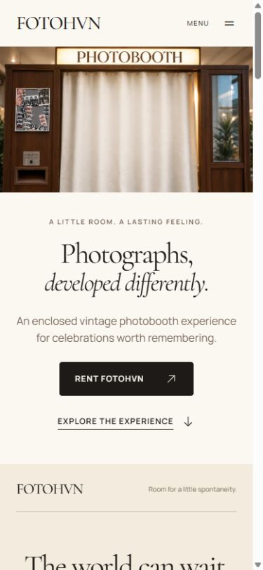
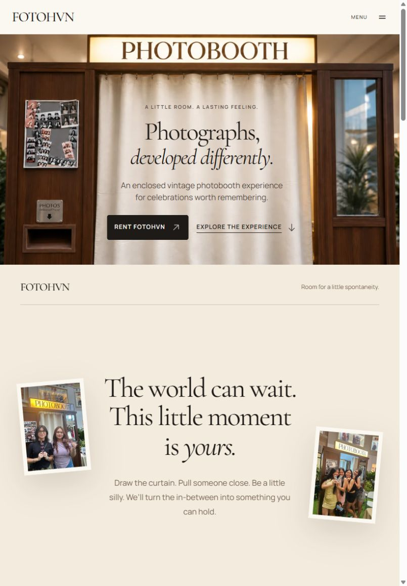

# Responsive hero review — 2026-09-10

Subsequent status: user approved immediate implementation. Completed work and verification are in `../responsive-editorial-lift/`; pending-approval wording below belongs to the historical review.

Scope: mobile/tablet hero and feasibility of bringing the selected desktop Editorial Lift to these viewports. Read-only application review; no production code changes. Current user feedback supersedes the previous assumption that static portrait flow is the desired design.

## Captured steps

1. Mobile rest, 390 × 844: readable but experiential mismatch. The complete wide facade sits above a separate copy block, making the hero feel like a conventional image-plus-text layout. Runtime data-lift-mode is flow.

2. Portrait tablet rest, 820 × 1180: text stays over the curtain, but the short landscape scene occupies less than half the viewport. Runtime data-lift-mode is flow; no paper overlap is enabled.

Both images were captured from the running localhost:3000 page in a separate in-app browser tab during this review, saved exactly and visually inspected. Audit tab closed and viewport reset afterward; user tab retained. No stored screenshot was substituted as evidence.

## Confirmed cause

HeroExterior.module.css moves copy into normal flow below the image at max-width 767px. editorialLiftMath.ts only enables overlap at width >= 768 and when heroHeight >= 72% of available viewport height. This disables the signature transition on phones and tall tablets. It is an intentional implementation fallback, not evidence of a device limitation.

## Recommended direction — pending approval

Preserve the selected desktop language, not its landscape dimensions. Give phones a portrait, near-viewport-height booth composition with live text/actions over the cream curtain and the raised sign still legible. Adapt the existing exterior into an accurately referenced portrait asset if needed; do not stretch timber/sign geometry or blindly cover-crop the wide asset. Tablets use a less narrow composition with the same integrated copy.

Enable the same native-scroll warm-paper overlap on both, with shorter travel (initial tuning target around 25–35% viewport on phones), subtle hero recession, first incoming headline followed by details, and natural continuation. Keep the curtain closed. Explore follows the same motion. Reduced-motion remains a direct handoff, not the default for every phone.

## Accessibility and limits

Current screenshots show readable content and visible actions, but do not prove full accessibility compliance. A portrait redesign must retain readable text sizes, contrast over cloth, touch targets and focus handling; do not squeeze everything onto short screens or force a long scroll trap. Validate 320/390 phones, portrait/landscape tablet, browser chrome changes and text zoom before claiming the proposed treatment works. This turn checked resting states and live mode flags/source; it did not implement or runtime-test the proposed animation.

Next decision: approve a portrait Editorial Lift visual preview before changing production code.
